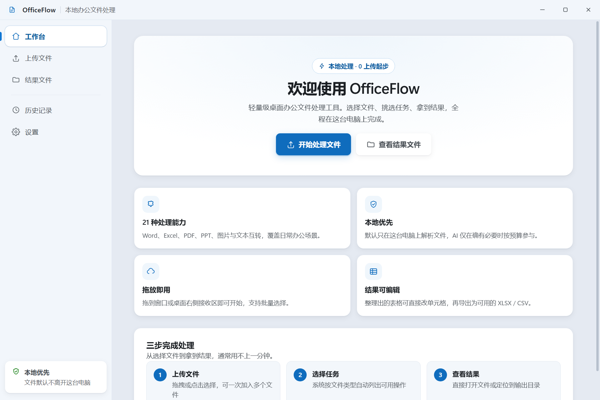
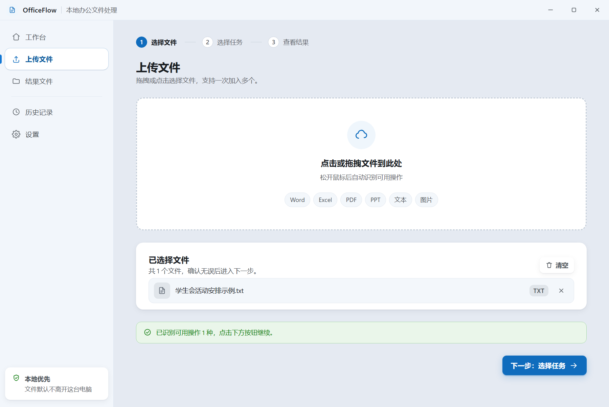
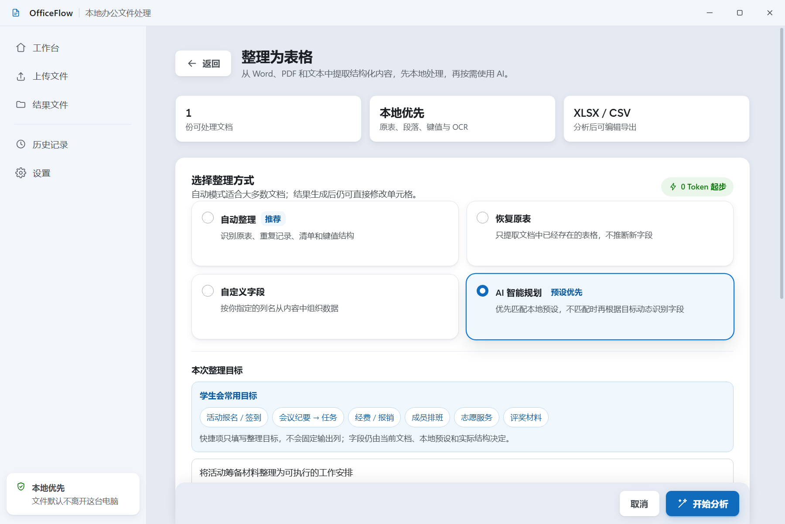
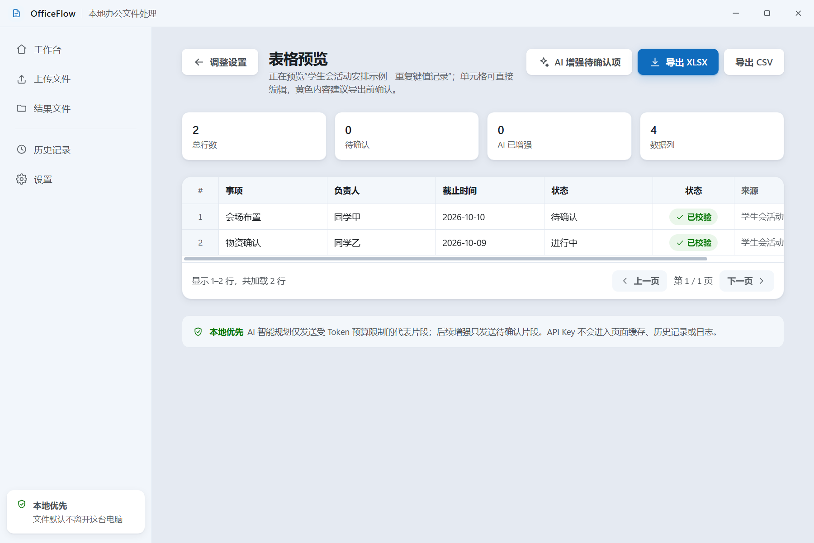
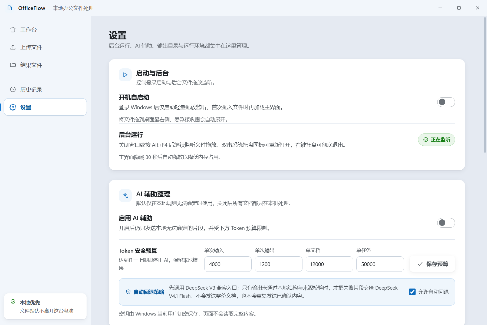
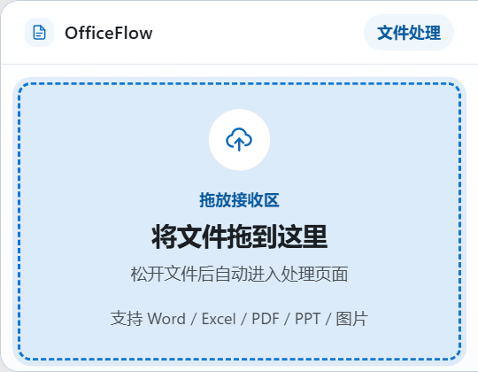

# OfficeFlow

[](https://github.com/kdjmd/officeflow/actions/workflows/ci.yml)
[](LICENSE)

OfficeFlow 是面向 Windows 的本地办公文件处理工具，适合大学生、学生会成员和日常办公场景。支持批量文件处理、文档整理为表格、桌面拖放接收与可选 AI 辅助。

## 功能

- Word、Excel、PowerPoint 文件转换；PDF 合并、拆分、压缩、旋转、水印及图片导出。
- 图片转换、压缩、调整尺寸与 Windows 本地 OCR。
- 将 Word、PDF、文本中的原生表格、分隔文本和键值记录整理为 XLSX/CSV，保留来源、置信度与待核对内容。
- 根据原文与用户目标确定字段；学生会常用报名、活动安排、物资清单和会议记录只是应用场景，不限制字段分类。
- 保存新表格的结构预设；已有格式匹配时优先本地处理，避免重复消耗 AI token。
- 支持开机后台启动、托盘运行；关闭窗口隐藏到后台。拖动文件时在屏幕右侧出现接收窗，放入后进入文件处理页面。
- AI 只有两个入口：DeepSeek V3 兼容接口和官方 Flash 回退接口。API key 由 Windows 加密存储，用户自行配置。

## 环境

- Windows 10/11 x64。仅从源码运行时需要 Node.js 22.12.0+、Python 3.11+（加入 PATH）；发行版内置运行时。
- 常规 Word/Excel/PowerPoint 转换及老式 `.doc` 读取需要安装相应 Microsoft Office 桌面应用。
- `.docx` 文本/原生表格、文本 PDF 和文本文件的表格分析无需启动 Office。
- 本地 OCR 需要 Windows OCR 组件及相应识别语言。

## 下载发行版

到 [GitHub Releases](https://github.com/kdjmd/officeflow/releases/latest) 下载 Windows x64 安装版或免安装 ZIP。发行版已内置 Python 与处理依赖；Office 格式转换仍需要本机 Microsoft Office。详见 [发行版说明](docs/RELEASE.md)。

## 软件截图与使用场景

以下为 Windows 发行程序的真实界面截图，文档和人员名称均为合成示例，不包含真实用户文件或 API key。

### 工作台：本地办公的统一入口

从工作台开始批量处理文件，查看支持的能力与环境状态。适合课程资料整理、学生会活动材料和日常办公；文档默认保留在本机。



### 选择文件：拖放、批量选择与按类型匹配任务

将文件拖入主窗口或点击选择，随后按文件类型显示可执行操作。支持 Word、Excel、PDF、PPT 和图片等文件；Office 格式转换需要本机 Office。



### 智能安排：按文档和目标设计字段

选择已有表格提取、自定义字段或智能安排。学生会报名、会议任务和物资清单只是快捷目标，输出列并不固定；用户可以描述自己的整理需求。预设匹配时优先本地处理，新格式可保存为结构预设。



### 表格预览：核对来源后导出

预览识别出的字段与数据，检查来源和待确认项，编辑后导出 XLSX / CSV。下图的活动任务记录由本地解析生成，未调用 AI；示例中的字段不是软件固定分类。



### 设置：后台运行与可控的 AI 消耗

集中管理登录启动、后台监控、结果目录和运行环境。AI 可选，只有 V3 兼容入口与官方 Flash 回退入口；密钥加密保存，可分别设置单次、单文档和单任务 Token 上限。截图展示配置界面，不代表已调用真实 AI 服务。



### 桌面接收窗：不打断当前工作

软件关闭主窗口后继续在托盘运行。空闲时接收窗隐藏，拖动文件到桌面右侧接收区时展开，放入后进入处理页面；普通框选不作为文件上传。正常移动文件、未投递到接收区时会在松开后收起。下图展示接收窗的展开界面。



## 从源码运行

```powershell
git clone https://github.com/kdjmd/officeflow.git
Set-Location officeflow\app-source
npm ci
python -m pip install -r requirements.txt
npm start
```

启动前会自动编译 C# 拖动监控辅助程序，使用 Windows 自带的 .NET Framework 编译器。首次 npm 安装会下载 Electron。

## 测试和打包

在 `app-source` 目录执行：

```powershell
npm test
npm run benchmark
npm run prepare:python
npm run build:win
npm run test:release
```

`prepare:python` 准备经过哈希验证的内置运行时；构建位于 `dist/win-unpacked`。生成安装版和免安装 ZIP 可运行 `npm run release:win`，验证打包后程序可运行 `npm run test:release`。构建不捆绑 Microsoft Office。默认测试不需要 Office；额外 Word 集成测试见 [qa/README.md](qa/README.md)。完整发布流程见 [发布维护指南](docs/PUBLISHING.md)。

## AI 与隐私

默认优先本地处理。只有启用 AI 且本地不能确定结构或内容时，才按任务发送必要片段到所配置的服务。请先检查文档是否含不应外发的个人或组织信息。预设仅保存表格结构，不保存文档行内容。

V3 入口允许填写 HTTPS 兼容地址与模型 ID；Flash 固定使用 DeepSeek 官方地址，当前模型 ID 为 `deepseek-flash`，内部保留旧配置键以兼容已有设置。没有 API key 时仍可进行本地处理。本项目未提供或内置付费 API key，自动测试不消耗 AI token。

仓库只包含源码、合成测试、文档和构建配置。用户文件、输出结果、API key、个人设置、日志、缓存、运行时和备份均不提交。

## 开源许可与贡献

OfficeFlow 采用 [AGPL-3.0-only](LICENSE)。PyMuPDF 使用 AGPL/商业双许可；本开源版本选择 AGPL 方式分发。第三方组件说明见 [THIRD_PARTY_NOTICES.md](THIRD_PARTY_NOTICES.md)。

贡献指南见 [CONTRIBUTING.md](CONTRIBUTING.md)，安全问题见 [SECURITY.md](SECURITY.md)。当前安全边界、依赖告警和后续改进记录在安全文档中。
